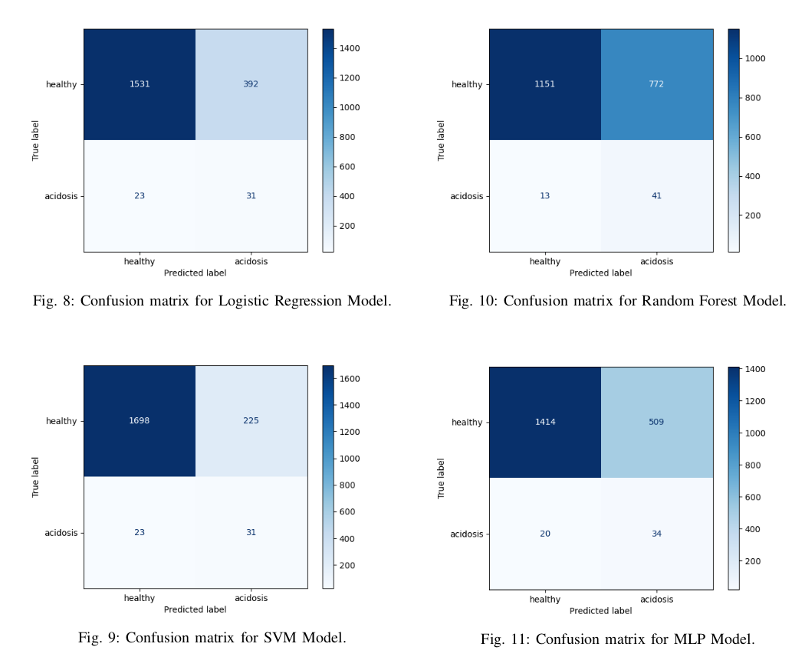
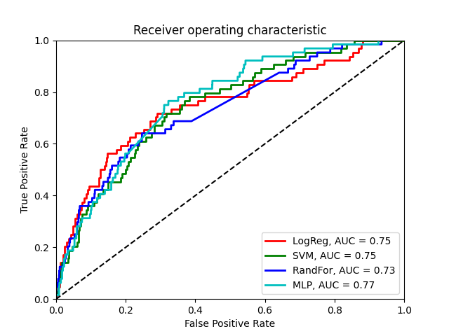
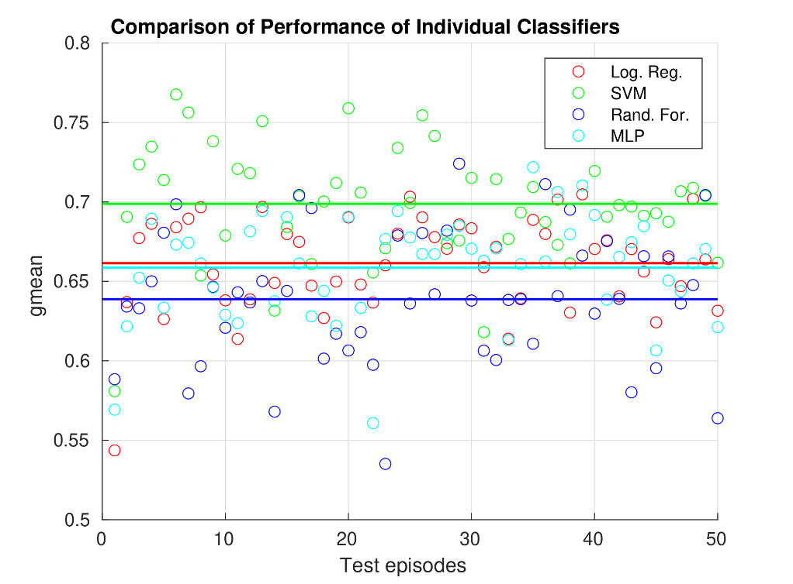

# Fetal-Acidosis-Classification
Repository containing my work on a semestral project addressing the problem of classifying Fetal Acidosis cases. This work was done as part of the [Artificial Intelligence](https://moodle.fel.cvut.cz/local/kos/pages/course/info.php?code=B3M33UI&semester=B162) course at CTU.

This `README` serves only as a brief description of the task at hand and to visually summarise the results. For a thorough description of used methods, models and a discussion of achieved results, please see
the report I have written that can be found in the `report` folder. 

## Project Description
The aim of this project was to classify cases of Fetal Acidosis (high levels of toxicity in an unborn baby's blood from available data gathered during birth. To solve this task, I implemented four machine-
learning models, namely the Logistic Regression, Support Vector Machine, Random Forest, and Multi-Layer Perceptron classificator. I tested the classifiers on real data using multiple performance measures, such as 
ROC curves, AUC, geometric mean, etc. All of the models showed to be comparably accurate and each one prevailed in a different tested aspect. The best model in terms of achieved average geometric mean score was 
found to be Support Vector Machine with an average geometric mean of 0.699 from 50 testing runs.

To enhance the performance of created models I did some preprocessing of the data. First, I standartised the features and then I over-sampled the dataset so that negative and positive acidosis cases are 
represented equally.

To solve the task I have used the `scikit-learn` Python library and there implemented models and methods.

## Repository Structure
  - `code` contains `Python` scripts that solve the task at hand.
  - `figs` is a folder containing all the figures used in this README as well as the figures that can be found in the report.
  - `report` contains a pdf file describing in depth all of the used algorithms and implementation aspects. It further describes and discusses achieved results.

## Used Models
Each of the used models is in-depth described in the .pdf report where I summarise all my results and methods. This report can be found in the `report` folder accessible from the root of this repo.

The key metric for evaluating the models was the *geometric mean* defined as $g = \sqrt{SE\cdot SP}$, where $SE = TP/(TP+FN)$ is sensitivity and $SP = TN/(TN+FP)$ is specificity.  

## Results
In this section, I briefly summarise the achieved results and compare the created models using multiple metrics.

### Confusion Matrices

### ROC and AUC

### Geometric Mean

